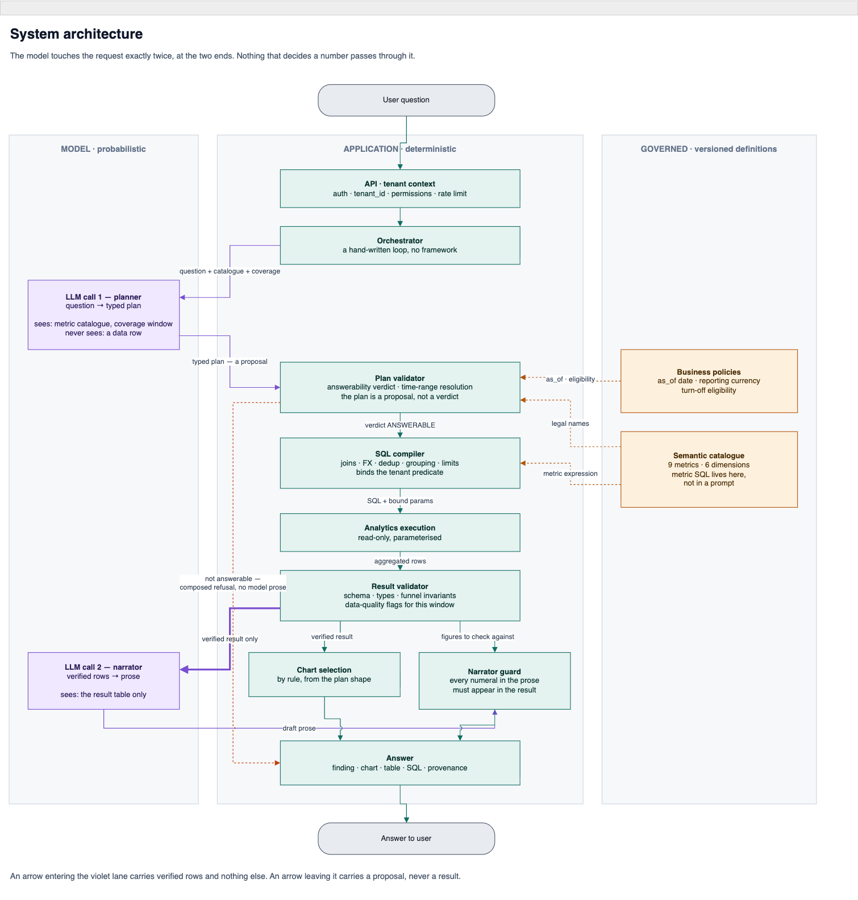
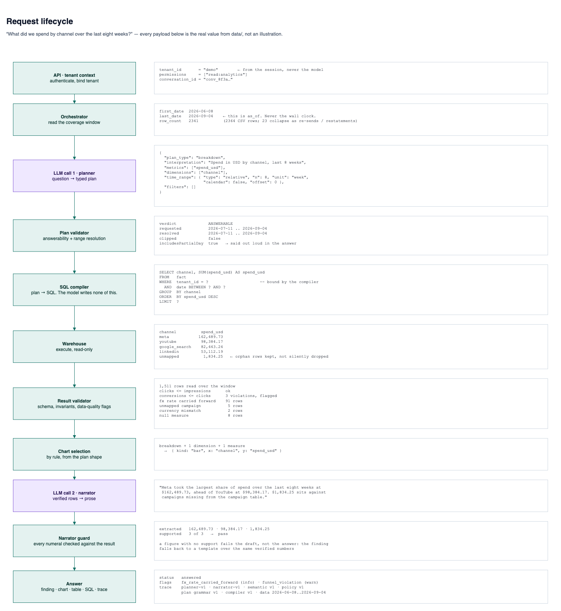
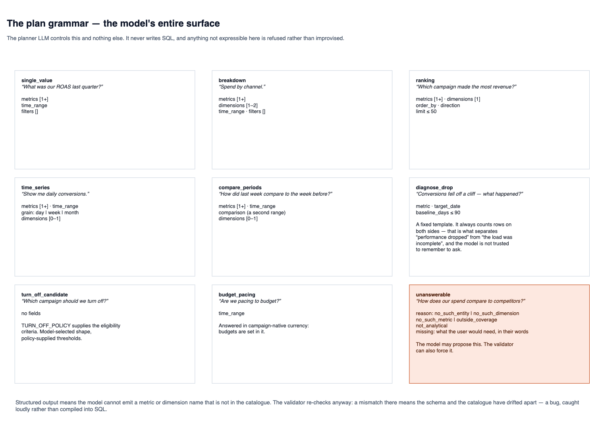
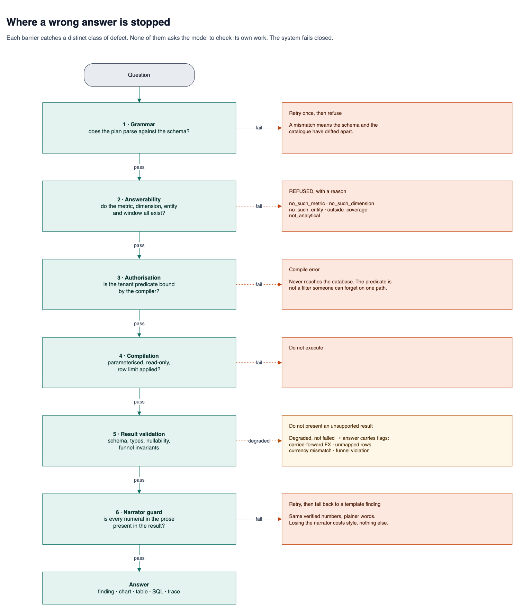
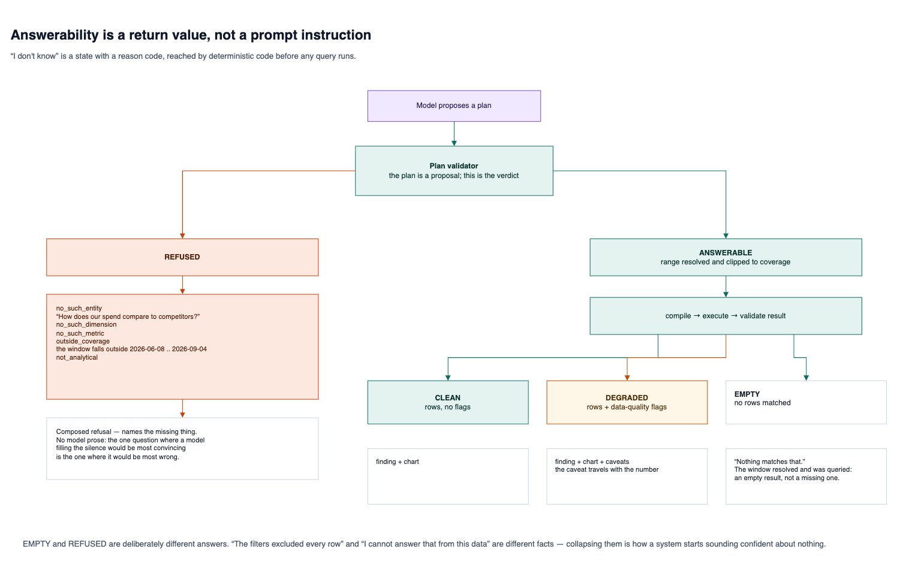
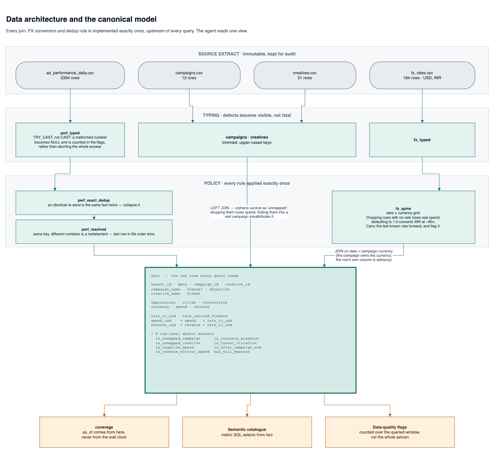
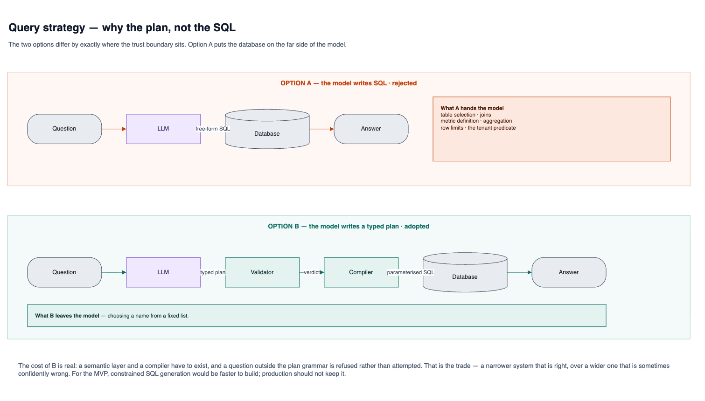
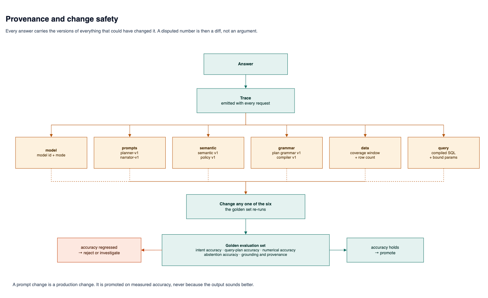

# Dashboard Agent — Architecture

**Diagram source:** [`architecture.drawio`](./architecture.drawio) — 8 pages, editable in
[draw.io](https://app.diagrams.net) or the *Draw.io Integration* VS Code extension.
The PNGs below are exports of those pages; the `.drawio` file is the thing to edit.

**Companion to [Design.md](./Design.md).** Design.md argues the design in prose; this document
draws it. Where a sentence said it faster, there is a sentence instead of a picture.

Every figure and payload here was taken from the code and the data in `data/`, not paraphrased
from the design doc. The numbers in Figure 2 are the real result of the real query.

**This file draws the design. [`mvp-architecture.drawio`](./mvp-architecture.drawio) draws the
build** — 9 pages in which every box is a file or a function in this repository: the module map,
the request path call by call, the `views.sql` ingest DAG, the plan grammar as compiled, every
exit from `ask()`, the eight barriers with the test that covers each, the two-layer golden check,
the credential and quota boundary, and the answer contract. Same colour key, so the two read
together — and where the build is stricter than the design, the picture says so.

---

## How to read the figures

The whole design turns on one distinction, so the figures encode it as colour and never reuse it
for anything else:

| Colour | Meaning | What it may decide |
|---|---|---|
| **Violet** | Probabilistic. An LLM call. | What the user *meant*, and how to say the answer in English. |
| **Teal** | Deterministic. Ordinary reviewed code. | Every number, every filter, every predicate, every refusal. |
| **Amber** | Versioned definitions. Changed only by a reviewed diff. | What a metric *is*. What the business policy *is*. |
| **Orange** | A stop. The request does not continue. | |

> The model determines what should be analysed; deterministic systems determine what the data says.

An arrow leaving the violet lane carries a *proposal*, never a result. An arrow entering it carries
verified rows and nothing else — the model is never handed the dataset.

---

## Figure 1 — System architecture

**The claim:** the model touches the request exactly twice, at the two ends, and nothing that
decides a number passes through it.

Three properties are visible here that the prose has to assert:

1. **The plan is a proposal.** The planner's output does not reach the compiler. It reaches the
   *validator*, which holds a verdict the model cannot overturn.
2. **The narrator is downstream of the numbers.** It receives the result and returns prose; the
   prose then passes a guard that re-checks it against the same rows. A narrator that invents a
   figure fails rather than shipping.
3. **The refusal path bypasses the model entirely** (the dashed orange edge). The one question
   where a model filling the silence would be most convincing is the one where it would be most
   wrong.

### The boundary, stated as ownership

| Decision | Owner | Why it sits there |
|---|---|---|
| What the user meant | Model | Language is the thing it is good at |
| Which metric and dimension | Model, **constrained to the catalogue** | Structured output cannot emit a name that does not exist |
| Whether the question is answerable | Application | A verdict, not a vibe |
| What a metric *is* | Semantic catalogue | `roas` is `SUM(revenue_usd) / NULLIF(SUM(spend_usd), 0)` in a reviewed file |
| Time range resolution | Application | "Last eight weeks" against `as_of`, clipped to coverage |
| Tenant identity | Application | Never a model-generated predicate |
| Joins, FX, dedup, limits | SQL compiler | Written once so no query path re-derives them |
| Arithmetic | Database | |
| Result validity | Result validator | |
| Chart type | Application, by rule | The picture cannot disagree with the text if neither chose freely |
| Wording of the answer | Model | |
| Every numeral in that wording | Narrator guard | Deterministic re-check, not a second opinion |

---

## Figure 2 — Request lifecycle

**The claim:** what actually crosses each hop, for the assignment's first question.

Every payload in that figure is real. Coverage in `data/` runs **2026-06-08 .. 2026-09-04**, so
`as_of` is 2026-09-04 and "the last eight weeks" resolves to a rolling window of
**2026-07-11 .. 2026-09-04**. Running the actual canonical model over that window gives:

| channel | spend_usd |
|---|--:|
| meta | 162,489.73 |
| youtube | 98,384.17 |
| google_search | 82,443.24 |
| linkedin | 53,112.19 |
| `unmapped` | 1,834.25 |

Two details worth reading off that table. `coverage.row_count` is **2341**, not the 2364 rows in
the CSV — 23 rows collapse as exact re-sends or restatements before anything queries them. And
`unmapped` is a real row in a real answer: performance rows whose campaign is missing from
`campaigns.csv` keep their spend under an explicit bucket rather than being dropped.

If the guard rejects the narrator's draft twice, the answer degrades to a template sentence over
the *same* verified numbers. Losing the narrator costs style and nothing else, because the figures
were never the model's to produce.

---

## Figure 3 — The plan grammar

**The claim:** this is the entire surface the planner LLM controls. It never writes SQL, and
anything not expressible here is refused rather than improvised.

Two of the nine shapes are worth calling out because they are where "the model decides" quietly
stops being true:

- **`diagnose_drop`** is a fixed template, not a model-composed query. It always compares a target
  day against a trailing baseline *and counts rows on both sides*. The row count is what separates
  "performance dropped" from "the load was incomplete", and the model is not trusted to remember to
  ask for it.
- **`turn_off_candidate`** carries no fields at all. The model selects the shape; `TURN_OFF_POLICY`
  supplies every threshold.

---

## Figure 4 — Where a wrong answer is stopped

**The claim:** the system fails closed. Each barrier catches a distinct class of defect, and none
of them asks the model to check its own work.

Barrier 2 is the one the assignment tests directly. *"How does our spend compare to our
competitors?"* does not fail at the database — it never gets there. There is no competitor entity
in the catalogue, so the verdict is `no_such_entity` and the refusal names the missing thing rather
than producing a plausible number.

---

## Figure 5 — Answerability as a first-class state

**The claim:** "I don't know" is a return value with a reason code, not a prompt instruction.

`EMPTY` and `REFUSED` are deliberately different answers. "The filters excluded every row" and
"I cannot answer that from this data" are different facts, and collapsing them is how a system
starts sounding confident about nothing.

---

## Figure 6 — Data architecture and the canonical model

**The claim:** every join, FX conversion and dedup rule is implemented exactly once, upstream of
every query. The agent reads one view.

Three judgement calls are worth reading off this figure, because each one changes a number:

- **Missing FX rate.** Dropping the row loses real spend; defaulting to `1.0` converts INR at
  roughly 90×. The spine carries the last known rate forward *and* sets `rate_carried_forward`, so
  the answer is produced and the caveat travels with it. Over the eight-week window in Figure 2
  that flag fires on 91 rows.
- **Currency ownership.** The campaign owns the currency; the performance row's own column is
  advisory and in this extract sometimes disagrees — 2 rows over that window.
- **Orphan rows.** A performance row with no matching campaign becomes `unmapped` rather than being
  dropped (which loses spend) or folded into a real campaign (which misattributes it).

---

## Figure 7 — Query strategy: why the plan, not the SQL

**The claim:** the two options differ by exactly where the trust boundary sits. Option A puts the
database on the far side of the model; Option B puts a validator and a compiler in between.

The cost of Option B is real: a semantic layer and a compiler have to exist, and a question outside
the plan grammar is refused rather than attempted. That is the trade being made — a narrower system
that is right, over a wider one that is sometimes confidently wrong.

---

## Figure 8 — Provenance and change safety

**The claim:** every answer carries the versions of everything that could have changed it. A
disputed number is then a diff, not an argument.

A prompt change is a production change. It is promoted on measured accuracy, never because the
output sounds better.

---

## MVP to production — what swaps, what does not

The interfaces in Figure 1 are the architecture. The vendors behind them are not.

| Component | Today, in this repo | Production | Does the boundary move? |
|---|---|---|---|
| Warehouse | DuckDB over the CSV extract | Snowflake / BigQuery / ClickHouse | No — compiler emits SQL either way |
| Ingestion | `views.sql` at boot | Scheduled pipeline into object storage, then transform | No |
| Tenant isolation | Real `tenant_id` predicate, one tenant in the extract | Row-level security or tenant-scoped schemas, *plus* the predicate | No |
| Query cache | none | Redis, keyed `tenant_id + semantic_version + query_hash + data_version` | No |
| Provenance | `Trace` returned with every answer | Same record, persisted and queryable | No |
| Observability | latency split per stage in the trace | OpenTelemetry spans on the same stages | No |
| Evaluation | golden-set tests in `tests/` | same set, gating prompt and model promotion in CI | No |

The tenant predicate is written into the compiler *now*, with one tenant in the extract, precisely
so it is not a filter someone adds later and forgets on one query path.

---

## Component to code

Every box in Figure 1 is a file, not an aspiration.

| Figure 1 box | Implementation |
|---|---|
| Orchestrator | [src/agent/orchestrate.ts](src/agent/orchestrate.ts) |
| LLM call 1 — planner | [src/agent/planner.ts](src/agent/planner.ts), [src/agent/prompts/planner.md](src/agent/prompts/planner.md) |
| Plan grammar | [src/plan/schema.ts](src/plan/schema.ts), [src/plan/wire.ts](src/plan/wire.ts) |
| Plan validator / answerability | [src/plan/validate.ts](src/plan/validate.ts) |
| Time range resolution | [src/plan/resolve.ts](src/plan/resolve.ts) |
| Semantic catalogue | [src/semantic/catalogue.ts](src/semantic/catalogue.ts) |
| Business policies | [src/semantic/policies.ts](src/semantic/policies.ts) |
| SQL compiler | [src/sql/compile.ts](src/sql/compile.ts) |
| Canonical model | [src/sql/views.sql](src/sql/views.sql) |
| Execution | [src/agent/execute.ts](src/agent/execute.ts), [src/db/duckdb.ts](src/db/duckdb.ts) |
| Result validator | [src/verify/resultValidator.ts](src/verify/resultValidator.ts), [src/verify/flags.ts](src/verify/flags.ts) |
| Chart selection | [src/chart/spec.ts](src/chart/spec.ts) |
| LLM call 2 — narrator | [src/agent/narrator.ts](src/agent/narrator.ts), [src/agent/prompts/narrator.md](src/agent/prompts/narrator.md) |
| Narrator guard | [src/verify/narratorGuard.ts](src/verify/narratorGuard.ts) |
| Composed refusal | [src/agent/compose.ts](src/agent/compose.ts) |
| Provenance | [src/trace/trace.ts](src/trace/trace.ts) |
| API | [app/api/ask/route.ts](app/api/ask/route.ts) |

---

## Where the implementation is stricter than Design.md

Two deltas, both deliberate, both tightening the boundary rather than loosening it:

1. **Chart selection is by rule, not by the model.** Design.md §5 assigns chart type to the LLM
   within supported types. The implementation derives it from the validated plan's shape in
   [src/chart/spec.ts](src/chart/spec.ts). This costs nothing in quality and removes the class of
   failure where the picture says something the text does not.
2. **The narrator guard is new.** Design.md relies on the narrator receiving only verified results.
   The implementation additionally extracts every numeric token from the generated prose and
   asserts each is supported by the result table. It is the cheapest real defence against the one
   failure the whole design exists to prevent, and it is deterministic.

---

## Editing the diagrams

1. Open [`architecture.drawio`](./architecture.drawio) — VS Code with the *Draw.io Integration*
   extension, or drag it into [app.diagrams.net](https://app.diagrams.net). It is plain
   uncompressed XML, so it diffs in review.
2. Edit the page you want. Each page is one figure above.
3. Re-export that page to `docs/diagrams/` under the same filename: **File ▸ Export as ▸ PNG**,
   zoom 150%, border 16, *Selection only* off.

Keep the colour key: violet is the model, teal is deterministic code, amber is a governed
definition, orange is a stop. It is the only thing the figures encode consistently.
